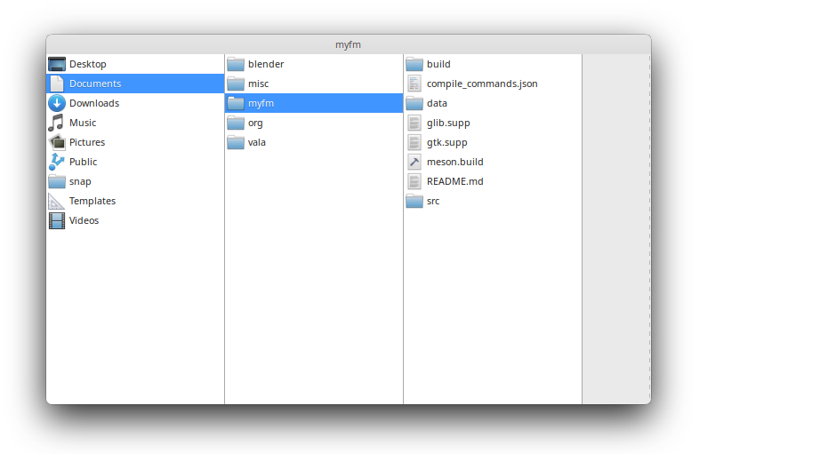

# myfm
### My personal file manager


 A simple column-view file manager based on gtk and gio, written in C.

### Features
Many important features like drag and drop, multiple file select, detailed file
info, etc. are yet to be implemented. Only basic operations like recursive copy,
delete, cut, create, sort and some others are supported at the moment.

### Building and Installation

myfm has the following build dependencies (you most likely have these already):
 - `gtk+-3.0`
 - `glib-2.0`
 - `gio-2.0`
 - `meson`

Version requirements aren't specified. Anything remotely recent should work as
I've made a deliberate choice to avoid using cutting edge library features. 

Run `meson build` and then `ninja` to build:
```bash
meson build
cd build
ninja
```
Then install and execute with:
```bash
sudo ninja install
com.github.f35idk.myfm
```
